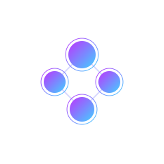
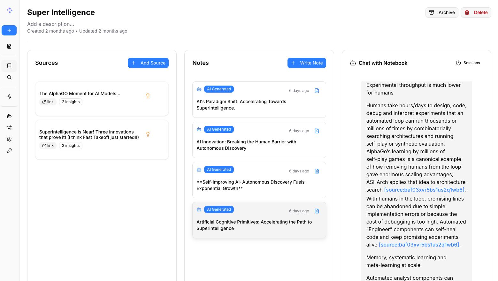

<a id="readme-top"></a>

<!-- [![Contributors][contributors-shield]][contributors-url] -->
[![Forks][forks-shield]][forks-url]
[![Stargazers][stars-shield]][stars-url]
[![Issues][issues-shield]][issues-url]
[![MIT License][license-shield]][license-url]
<!-- [![LinkedIn][linkedin-shield]][linkedin-url] -->


<!-- PROJECT LOGO -->
<br />
<div align="center">
  <a href="https://github.com/lfnovo/open-notebook">
    
  </a>

  <h3 align="center">Open Notebook</h3>

  <p align="center">
    An open source, privacy-focused alternative to Google's Notebook LM!
    <br /><strong>Join our <a href="https://discord.gg/37XJPXfz2w">Discord server</a> for help, to share workflow ideas, and suggest features!</strong>
    <br />
    <a href="https://www.open-notebook.ai"><strong>Checkout our website »</strong></a>
    <br />
    <br />
    <a href="docs/0-START-HERE/index.md">📚 Get Started</a>
    ·
    <a href="docs/3-USER-GUIDE/index.md">📖 User Guide</a>
    ·
    <a href="docs/2-CORE-CONCEPTS/index.md">✨ Features</a>
    ·
    <a href="docs/1-INSTALLATION/index.md">🚀 Deploy</a>
  </p>
</div>

<p align="center">
<a href="https://trendshift.io/repositories/14536" target="_blank"></a>
</p>

<div align="center">
  <!-- Keep these links. Translations will automatically update with the README. -->
  <a href="https://zdoc.app/de/lfnovo/open-notebook">Deutsch</a> | 
  <a href="https://zdoc.app/es/lfnovo/open-notebook">Español</a> | 
  <a href="https://zdoc.app/fr/lfnovo/open-notebook">français</a> | 
  <a href="https://zdoc.app/ja/lfnovo/open-notebook">日本語</a> | 
  <a href="https://zdoc.app/ko/lfnovo/open-notebook">한국어</a> | 
  <a href="https://zdoc.app/pt/lfnovo/open-notebook">Português</a> | 
  <a href="https://zdoc.app/ru/lfnovo/open-notebook">Русский</a> | 
  <a href="https://zdoc.app/zh/lfnovo/open-notebook">中文</a>
</div>

## A private, multi-model, 100% local, full-featured alternative to Notebook LM



In a world dominated by Artificial Intelligence, having the ability to think 🧠 and acquire new knowledge 💡, is a skill that should not be a privilege for a few, nor restricted to a single provider.

**Open Notebook empowers you to:**
- 🔒 **Control your data** - Keep your research private and secure
- 🤖 **Choose your AI models** - Support for 16+ providers including OpenAI, Anthropic, Ollama, LM Studio, and more
- 📚 **Organize multi-modal content** - PDFs, videos, audio, web pages, and more
- 🎙️ **Generate professional podcasts** - Advanced multi-speaker podcast generation
- 🔍 **Search intelligently** - Full-text and vector search across all your content
- 💬 **Chat with context** - AI conversations powered by your research

Learn more about our project at [https://www.open-notebook.ai](https://www.open-notebook.ai)

---

## 🆚 Open Notebook vs Google Notebook LM

| Feature | Open Notebook | Google Notebook LM | Advantage |
|---------|---------------|--------------------|-----------|
| **Privacy & Control** | Self-hosted, your data | Google cloud only | Complete data sovereignty |
| **AI Provider Choice** | 16+ providers (OpenAI, Anthropic, Ollama, LM Studio, etc.) | Google models only | Flexibility and cost optimization |
| **Podcast Speakers** | 1-4 speakers with custom profiles | 2 speakers only | Extreme flexibility |
| **Content Transformations** | Custom and built-in | Limited options | Unlimited processing power |
| **API Access** | Full REST API | No API | Complete automation |
| **Deployment** | Docker, cloud, or local | Google hosted only | Deploy anywhere |
| **Citations** | Basic references (will improve) | Comprehensive with sources | Research integrity |
| **Customization** | Open source, fully customizable | Closed system | Unlimited extensibility |
| **Cost** | Pay only for AI usage | Free tier + Monthly subscription | Transparent and controllable |

**Why Choose Open Notebook?**
- 🔒 **Privacy First**: Your sensitive research stays completely private
- 💰 **Cost Control**: Choose cheaper AI providers or run locally with Ollama
- 🎙️ **Better Podcasts**: Full script control and multi-speaker flexibility vs limited 2-speaker deep-dive format
- 🔧 **Unlimited Customization**: Modify, extend, and integrate as needed
- 🌐 **No Vendor Lock-in**: Switch providers, deploy anywhere, own your data

### Built With

[![Python][Python]][Python-url] [![Next.js][Next.js]][Next-url] [![React][React]][React-url] [![SurrealDB][SurrealDB]][SurrealDB-url] [![LangChain][LangChain]][LangChain-url]

## 🚀 Quick Start

Choose your installation method:

### 🐳 **Docker (Recommended)**

**Best for most users** - Fast setup with Docker Compose:

→ **[Docker Compose Installation Guide](docs/1-INSTALLATION/docker-compose.md)**
- Multi-container setup (recommended)
- 5-10 minutes setup time
- Requires Docker Desktop

**Quick Start:**
- Get an API key (OpenAI, Anthropic, Google, etc.) or setup Ollama
- Create docker-compose.yml (example in guide)
- Run: docker compose up -d
- Access: http://localhost:8502

---

### 💻 **From Source (Developers)**

**For development and contributors:**

→ **[From Source Installation Guide](docs/1-INSTALLATION/from-source.md)**
- Clone and run locally
- 10-15 minutes setup time
- Requires: Python 3.11+, Node.js 18+, Docker, uv

**Quick Start:**
```bash
git clone https://github.com/lfnovo/open-notebook.git
uv sync
make start-all
```

Access: http://localhost:3000 (dev) or http://localhost:8502 (production)

---

### 📖 Need Help?

- **🤖 AI Installation Assistant**: [CustomGPT to help you install](https://chatgpt.com/g/g-68776e2765b48191bd1bae3f30212631-open-notebook-installation-assistant)
- **🆘 Troubleshooting**: [5-minute troubleshooting guide](docs/6-TROUBLESHOOTING/quick-fixes.md)
- **💬 Community Support**: [Discord Server](https://discord.gg/37XJPXfz2w)
- **🐛 Report Issues**: [GitHub Issues](https://github.com/lfnovo/open-notebook/issues)

---

## Star History

[](https://www.star-history.com/#lfnovo/open-notebook&type=date&legend=top-left)


## Provider Support Matrix

Thanks to the [Esperanto](https://github.com/lfnovo/esperanto) library, we support this providers out of the box!

| Provider     | LLM Support | Embedding Support | Speech-to-Text | Text-to-Speech |
|--------------|-------------|------------------|----------------|----------------|
| OpenAI       | ✅          | ✅               | ✅             | ✅             |
| Anthropic    | ✅          | ❌               | ❌             | ❌             |
| Groq         | ✅          | ❌               | ✅             | ❌             |
| Google (GenAI) | ✅          | ✅               | ❌             | ✅             |
| Vertex AI    | ✅          | ✅               | ❌             | ✅             |
| Ollama       | ✅          | ✅               | ❌             | ❌             |
| Perplexity   | ✅          | ❌               | ❌             | ❌             |
| ElevenLabs   | ❌          | ❌               | ✅             | ✅             |
| Azure OpenAI | ✅          | ✅               | ❌             | ❌             |
| Mistral      | ✅          | ✅               | ❌             | ❌             |
| DeepSeek     | ✅          | ❌               | ❌             | ❌             |
| Voyage       | ❌          | ✅               | ❌             | ❌             |
| xAI          | ✅          | ❌               | ❌             | ❌             |
| OpenRouter   | ✅          | ❌               | ❌             | ❌             |
| OpenAI Compatible* | ✅          | ❌               | ❌             | ❌             |

*Supports LM Studio and any OpenAI-compatible endpoint

## ✨ Key Features

### Core Capabilities
- **🔒 Privacy-First**: Your data stays under your control - no cloud dependencies
- **🎯 Multi-Notebook Organization**: Manage multiple research projects seamlessly
- **📚 Universal Content Support**: PDFs, videos, audio, web pages, Office docs, and more
- **🤖 Multi-Model AI Support**: 16+ providers including OpenAI, Anthropic, Ollama, Google, LM Studio, and more
- **🎙️ Professional Podcast Generation**: Advanced multi-speaker podcasts with Episode Profiles
- **🔍 Intelligent Search**: Full-text and vector search across all your content
- **💬 Context-Aware Chat**: AI conversations powered by your research materials
- **📝 AI-Assisted Notes**: Generate insights or write notes manually

### Advanced Features
- **⚡ Reasoning Model Support**: Full support for thinking models like DeepSeek-R1 and Qwen3
- **🔧 Content Transformations**: Powerful customizable actions to summarize and extract insights
- **🌐 Comprehensive REST API**: Full programmatic access for custom integrations [](http://localhost:5055/docs)
- **🔐 Optional Password Protection**: Secure public deployments with authentication
- **📊 Fine-Grained Context Control**: Choose exactly what to share with AI models
- **📎 Citations**: Get answers with proper source citations


## Podcast Feature

[](https://www.youtube.com/watch?v=D-760MlGwaI)

## 📚 Documentation

### Getting Started
- **[📖 Introduction](docs/0-START-HERE/index.md)** - Learn what Open Notebook offers
- **[⚡ Quick Start](docs/0-START-HERE/quick-start.md)** - Get up and running in 5 minutes
- **[🔧 Installation](docs/1-INSTALLATION/index.md)** - Comprehensive setup guide
- **[🎯 Your First Notebook](docs/0-START-HERE/first-notebook.md)** - Step-by-step tutorial

### User Guide
- **[📱 Interface Overview](docs/3-USER-GUIDE/interface-overview.md)** - Understanding the layout
- **[📚 Notebooks](docs/3-USER-GUIDE/notebooks.md)** - Organizing your research
- **[📄 Sources](docs/3-USER-GUIDE/sources.md)** - Managing content types
- **[📝 Notes](docs/3-USER-GUIDE/notes.md)** - Creating and managing notes
- **[💬 Chat](docs/3-USER-GUIDE/chat.md)** - AI conversations
- **[🔍 Search](docs/3-USER-GUIDE/search.md)** - Finding information

### Advanced Topics
- **[🎙️ Podcast Generation](docs/2-CORE-CONCEPTS/podcasts.md)** - Create professional podcasts
- **[🔧 Content Transformations](docs/2-CORE-CONCEPTS/transformations.md)** - Customize content processing
- **[🤖 AI Models](docs/4-AI-PROVIDERS/index.md)** - AI model configuration
- **[🔌 MCP Integration](docs/5-CONFIGURATION/mcp-integration.md)** - Connect with Claude Desktop, VS Code and other MCP clients
- **[🔧 REST API Reference](docs/7-DEVELOPMENT/api-reference.md)** - Complete API documentation
- **[🔐 Security](docs/5-CONFIGURATION/security.md)** - Password protection and privacy
- **[🚀 Deployment](docs/1-INSTALLATION/index.md)** - Complete deployment guides for all scenarios

<p align="right">(<a href="#readme-top">back to top</a>)</p>

## 🗺️ Roadmap

### Upcoming Features
- **Live Front-End Updates**: Real-time UI updates for smoother experience
- **Async Processing**: Faster UI through asynchronous content processing
- **Cross-Notebook Sources**: Reuse research materials across projects
- **Bookmark Integration**: Connect with your favorite bookmarking apps

### Recently Completed ✅
- **Next.js Frontend**: Modern React-based frontend with improved performance
- **Comprehensive REST API**: Full programmatic access to all functionality
- **Multi-Model Support**: 16+ AI providers including OpenAI, Anthropic, Ollama, LM Studio
- **Advanced Podcast Generator**: Professional multi-speaker podcasts with Episode Profiles
- **Content Transformations**: Powerful customizable actions for content processing
- **Enhanced Citations**: Improved layout and finer control for source citations
- **Multiple Chat Sessions**: Manage different conversations within notebooks

See the [open issues](https://github.com/lfnovo/open-notebook/issues) for a full list of proposed features and known issues.

<p align="right">(<a href="#readme-top">back to top</a>)</p>


## 📖 Need Help?
- **🤖 AI Installation Assistant**: We have a [CustomGPT built to help you install Open Notebook](https://chatgpt.com/g/g-68776e2765b48191bd1bae3f30212631-open-notebook-installation-assistant) - it will guide you through each step!
- **New to Open Notebook?** Start with our [Getting Started Guide](docs/0-START-HERE/index.md)
- **Need installation help?** Check our [Installation Guide](docs/1-INSTALLATION/index.md)
- **Want to see it in action?** Try our [Quick Start Tutorial](docs/0-START-HERE/quick-start.md)

## 🤝 Community & Contributing

### Join the Community
- 💬 **[Discord Server](https://discord.gg/37XJPXfz2w)** - Get help, share ideas, and connect with other users
- 🐛 **[GitHub Issues](https://github.com/lfnovo/open-notebook/issues)** - Report bugs and request features
- ⭐ **Star this repo** - Show your support and help others discover Open Notebook

### Contributing
We welcome contributions! We're especially looking for help with:
- **Frontend Development**: Help improve our modern Next.js/React UI
- **Testing & Bug Fixes**: Make Open Notebook more robust
- **Feature Development**: Build the coolest research tool together
- **Documentation**: Improve guides and tutorials

**Current Tech Stack**: Python, FastAPI, Next.js, React, SurrealDB
**Future Roadmap**: Real-time updates, enhanced async processing

See our [Contributing Guide](CONTRIBUTING.md) for detailed information on how to get started.

<p align="right">(<a href="#readme-top">back to top</a>)</p>


## 📄 License

Open Notebook is MIT licensed. See the [LICENSE](LICENSE) file for details.


**Community Support**:
- 💬 [Discord Server](https://discord.gg/37XJPXfz2w) - Get help, share ideas, and connect with users
- 🐛 [GitHub Issues](https://github.com/lfnovo/open-notebook/issues) - Report bugs and request features
- 🌐 [Website](https://www.open-notebook.ai) - Learn more about the project

<p align="right">(<a href="#readme-top">back to top</a>)</p>


<!-- MARKDOWN LINKS & IMAGES -->
<!-- https://www.markdownguide.org/basic-syntax/#reference-style-links -->
[contributors-shield]: https://img.shields.io/github/contributors/lfnovo/open-notebook.svg?style=for-the-badge
[contributors-url]: https://github.com/lfnovo/open-notebook/graphs/contributors
[forks-shield]: https://img.shields.io/github/forks/lfnovo/open-notebook.svg?style=for-the-badge
[forks-url]: https://github.com/lfnovo/open-notebook/network/members
[stars-shield]: https://img.shields.io/github/stars/lfnovo/open-notebook.svg?style=for-the-badge
[stars-url]: https://github.com/lfnovo/open-notebook/stargazers
[issues-shield]: https://img.shields.io/github/issues/lfnovo/open-notebook.svg?style=for-the-badge
[issues-url]: https://github.com/lfnovo/open-notebook/issues
[license-shield]: https://img.shields.io/github/license/lfnovo/open-notebook.svg?style=for-the-badge
[license-url]: https://github.com/lfnovo/open-notebook/blob/master/LICENSE.txt
[linkedin-shield]: https://img.shields.io/badge/-LinkedIn-black.svg?style=for-the-badge&logo=linkedin&colorB=555
[linkedin-url]: https://linkedin.com/in/lfnovo
[product-screenshot]: images/screenshot.png
[Next.js]: https://img.shields.io/badge/Next.js-000000?style=for-the-badge&logo=next.js&logoColor=white
[Next-url]: https://nextjs.org/
[React]: https://img.shields.io/badge/React-61DAFB?style=for-the-badge&logo=react&logoColor=black
[React-url]: https://reactjs.org/
[Python]: https://img.shields.io/badge/Python-3776AB?style=for-the-badge&logo=python&logoColor=white
[Python-url]: https://www.python.org/
[LangChain]: https://img.shields.io/badge/LangChain-3A3A3A?style=for-the-badge&logo=chainlink&logoColor=white
[LangChain-url]: https://www.langchain.com/
[SurrealDB]: https://img.shields.io/badge/SurrealDB-FF5E00?style=for-the-badge&logo=databricks&logoColor=white
[SurrealDB-url]: https://surrealdb.com/
